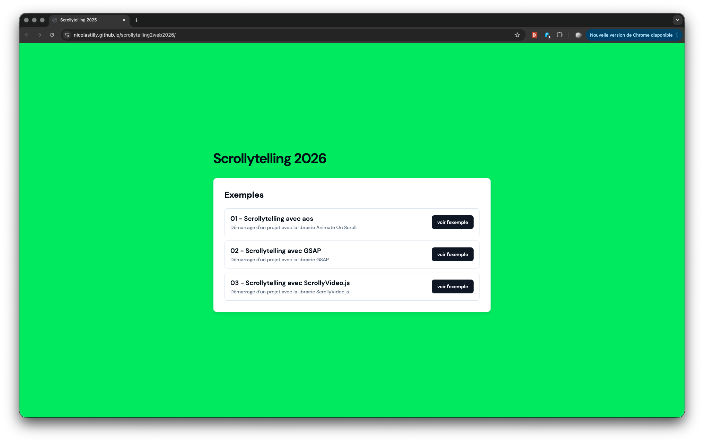

# Exemples du cours scrollytelling 2 web 2026

Démarrage le mardi 20 janvier 2026.

### Scrollytelling mobile first

Ce site présente des exemples et des démos d'expériences de scroll en mobile first. Les exemples se basent sur 3 librairies :

- [AOS](https://michalsnik.github.io/aos/)
- [ScrollyVideo.js](https://scrollyvideo.js.org/)
- [GSAP](https://gsap.com/scroll/)

### Organisation des exemples

Les fichiers du site et le code sont organisés de la façon suivante :
- Chaque dossier `01`, `02`, `03`... comporte les fichiers de l'exercice correspondant
- Dans chaque dossier, le fichier `content.html` sert uniquement à l'affichaque mobile dans la page
- Les fichiers `index.html` et `style.css` comportent eux le code de l'exercice

